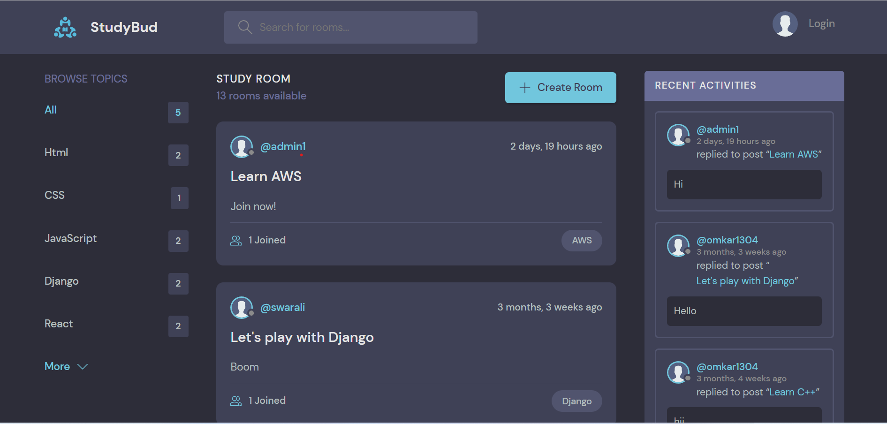

# StudyBud-using-Django

A platform for developers to connect, collaborate, and learn new technologies together.

## Description

This platform was created as a clone of the popular communication app, Discord, with a focus on providing a space for developers to share their knowledge and expertise. The frontend was developed using HTML/CSS and JavaScript, while the backend was implemented with the Django Framework and a SQLite database. The platform is deployed on the pythonanywhere hosting service, offering users a reliable and secure environment for communication and learning. The end result is a user-friendly and functional platform for developers to connect, share their knowledge, and stay up-to-date with the latest advancements in technology.

## Live Project Link

The project is hosted on pythonanywhere and can be accessed using the following link - https://studybudweb.pythonanywhere.com/

## Features

- User registration and login
- User profiles
- Chat rooms for communication and collaboration
- A library of resources for developers to learn new technologies
- Ability to create and join groups related to specific technologies

## Technology Stack

- Frontend: HTML/CSS, JavaScript
- Backend: Django Framework, SQLite database
- Hosting: pythonanywhere

## Getting Started

To get started with this platform, follow these steps:

1. Clone the repository to your local machine

2. Install the required packages and dependencies

3. Run the development server

4. Access the platform at http://localhost:8000 in your web browser

## Contributions

Contributions to this project are welcome. If you would like to contribute, please follow these steps:

1. Fork the repository
2. Create a new branch for your changes
3. Make the necessary changes and commit them
4. Create a pull request
